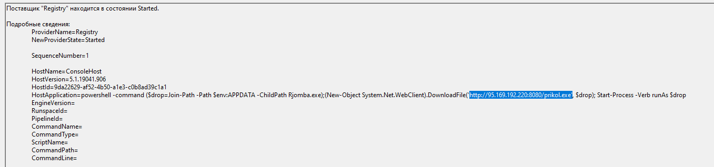
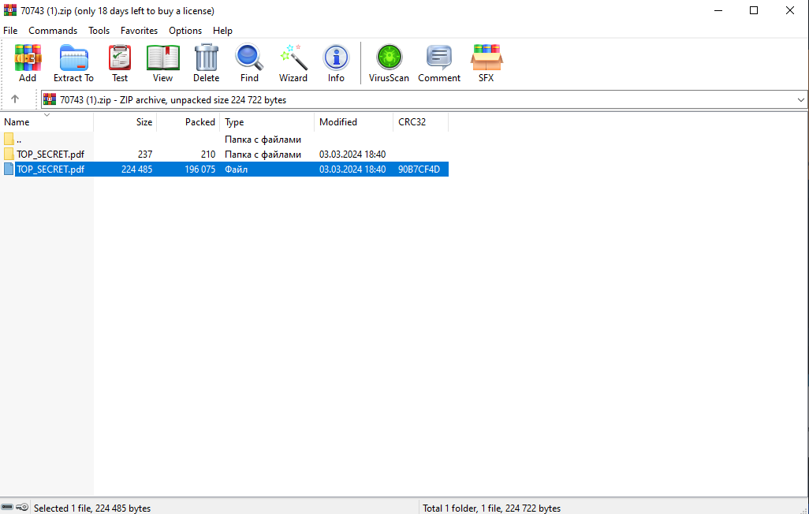
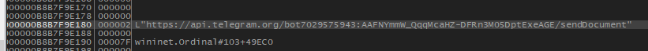

# История файла
Посмотрим на машинку беглым взглядом. В %AppData% находим некий `Rjomba.exe`, дата его создания **3 марта 18:43**. Посмотрим события в Windows в `eventvwr.msc` в это время. Во вкладке PowerShell находим команду, которая с удаленного сервера скачивает и запускает этот самый `Rjomba.exe`. 

По легенде, пришло фишинговое письмо, откуда было запущено ВПО. Проверим историю браузеров. В **Edge** замечаем некий `TOP_SECRET.pdf` в архиве, который был удален. Попробуем восстановить этот архив, запустим любую программу по восстановлению файлов, в данном случае мы воспользовались программой от EaseUS. Там мы увидели файл `TOP_SECRET.pdf` и папку `TOP_SECRET.pdf`, в которой лежал `TOP_SECRET.pdf.cmd`. Как известно, Windows умеет опускать `.bat`, `.exe` и `.cmd`, а в `.cmd` как раз лежит команда для PowerShell. Именно таким образом и было получено и запущено ВПО.

## 1. Как ВПО попало на компьютер?
Через фишинговое письмо

## 2. С какого сервера?
http://95.169.192.220:8080

## 3. С помощью какой уязвимости данное ВПО запустилось? В каком ПО?
Уязвимость: CVE-2023-38831, [https://habr.com/ru/articles/797127/](https://habr.com/ru/articles/797127/) \
Присуща архиваторам, сам скрипт был запущен в PowerShell \ \

# Анализ файла

Попытавшись запустить программу с дебаггером, она выключается. Посмотрев на действия программы до её закрытия, находим, как именно она определяет наличие откладчика

# 4. Какие методы противодействия отладке использует программа? 

При исполнении программы вызываются прерывания int 3 которые без откладчика вызовут EXCEPTION_BREAKPOINT и будут переданы обработчику исключений, а при присутствии исключение не будет передано обработчику \
isDebuggerPresent() возвращает true, если программа в деабггере и false, если нет

# 5. Какой алгоритм шифрования используется при шифровании данных? Стоимость: 10
Использеутся библиотека crypto++ - в зависимостях она видна при дизассембле
Используется шифр 256 битный AES в режиме CBC - есть функция CBC в crypto++
Испольуется base64 - видно по файлам

# 7. Куда злоумышленник отсылает собранные данные? Каким образом он аутентифицируется на endpoint?
Вирус отсылает данные на бота через API телеграмма

