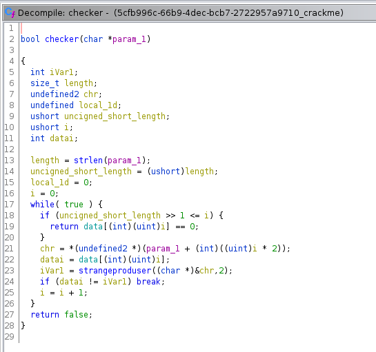
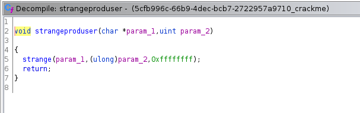
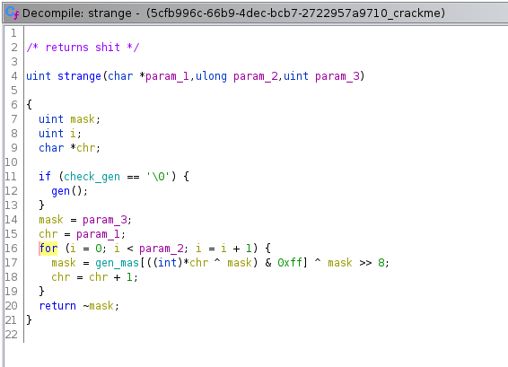
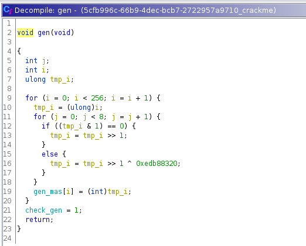

# Rev 1
Получаем бинарник. Запустим без параметров получим No flag provided, exiting.\
Открываем его в Ghidra.\
Найдём функцию, с которой начинается выполнение. Это функция FUN_00101345\
Переименуем её и переменные для понятности.
\
Заметим, что флаг передаётся через первый аргумент командной строки и анализируется функцией checker.\
Она в свою очередь проверяет строку следующим образом:\
1. Берёт два подрядидущих символов и отправляет их в функцию strange.\
2. Берёт i-ый элемент типа int из массива data\
3. Сравнивает их. Если не равны, то всё плохо, мы вернём в main 0\
4. Если строка и массив data закончились, и все проверки прошли, то всё ок, вернём в main 1\
\
Перейдём в strangeproduser и заметим, что он возвращает результат работы функции strange от двух символов строки, числа 2, и mask=0xffffffff\
\
В strange происходит дальнейшее вычисление mask, которое мы просто повторим в коде. После чего возвращается значение mask\
\
Также нас интересует функция gen, которая создаёт gen_mas, необходимый для генерации mask. Это тоже происходит странным образом, поэтому просто перепишем в код\
\
Итак что мы получили? У нас есть известная data, которая лежит в памяти, gen_mas, принцип генерации которого нам известен, и mask, вычисление которой мы тоже представляем. Неизвестной остаётся строка. Но её можно перебрать. А именно можно перебирать только 2 символа, вычислять mask и проверять к какому значению data оно подходит. Для этого напишем программу rev1.c. После чего соберём флаг.\
\
