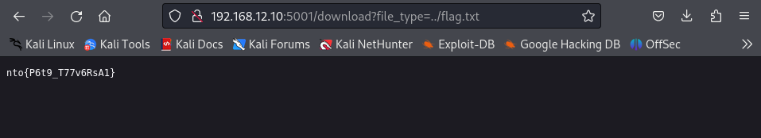

#Web 1
Открываем сайт и видим календарь, нажимаем на 20 число и видим:
```
Hint_1 

maybe in etc/secret ???
```
(pic1.png)
Видим путь до файла в ссылке, пытаемся через него прочитать флаг:
http://192.168.12.10:5001/download?file_type=flag.txt не работает
Пробуем ../flag.txt
Сработало! 

